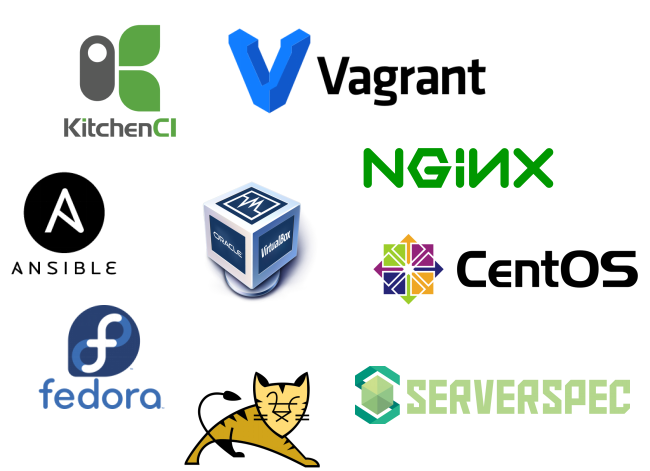
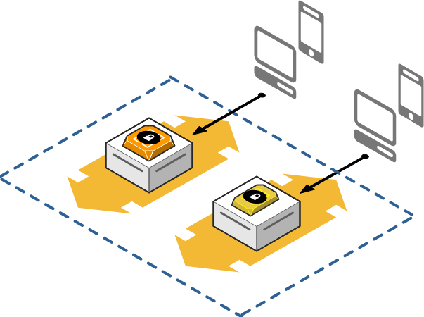
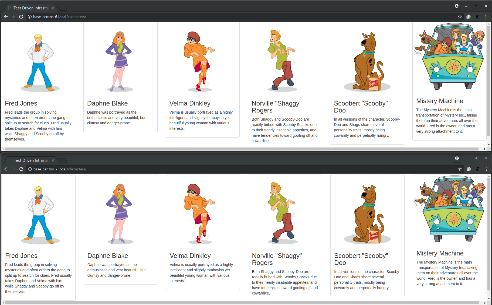

Test Driven ~~Development~~ Infrastructure
======================================

Once upon a time, a guy named [Kief Morris](https://www.linkedin.com/in/kiefmorris/) realized that techiniques largely used in software development, could also be applied on infrastructure. Luckly, he was not crazy, he acctually wrote a book that describes exactly what can be done on infrastructure side. His book is called [Infrastructure as Code](http://shop.oreilly.com/product/0636920039297.do).

Some may think that this is something that can only be applied to public cloud infrastructure, and the main goal of this demo is to prove exactly the opposite.

Test-driven development (TDD) is a software development process that relies on the repetition of a very short development cycle: Specific test cases are built base on requirements, then the software is improved until all test cases are running with no issue. In another hand, traditional software development allows developers to change/add code which might not meet all the requirements. Throughout this demo, I'll show how to leverage TDD benefits on infrastructure world.

> **WARNING:** This is not an easy topic, please be sure you have enough experience to get the benefits from this demo.

> **HELP:** If you see an issue, typo or any kind of mistake within this project, please don't forgive me, send me a PR instead. Appreciated.

Requirements
------------
In order to do this demo, I had to use a few Open Source tools and all of them will be described bellow:

<p align="center">
    
</p>

* [Fedora](https://getfedora.org/) is my main Operating System, I have no clue how to put this demo to work on Windows or Mac, please feel free to use it as inspiration to port the demo to other platforms. I also didn't test, but I believe minor adjustments need to be done in order to make it work on different GNU/Linux distros.
* [Ansible](https://www.ansible.com/) delivers simple IT automation that ends repetitive tasks and frees up DevOps teams for more strategic work.
* [Test Kitchen](https://kitchen.ci/) is an integration tool for developing and testing infrastructure code and software on isolated target platforms.
* [VirtualBox](virtualbox.org) is a general-purpose full virtualizer for x86 hardware.
* [Vagrant](https://www.vagrantup.com/) is a tool for building and managing virtual machine environments in a single workflow.
* [CentOS](https://www.centos.org/) project is a community-driven free software effort focused on delivering a robust open source ecosystem.
* [Tomcat](https://tomcat.apache.org/) is an open source implementation of the Java Servlet, JavaServer Pages, Java Expression Language and Java WebSocket technologies.
* [NGINX](https://nginx.org) pronounced [engine x] is an HTTP and reverse proxy server, a mail proxy server, and a generic TCP/UDP proxy server.
* [ServerSpec](http://serverspec.org/) tests your servers’ actual state by executing command locally, via SSH, via WinRM, via Docker API and so on.

> **NOTICE:** I will not cover the basic installation of each tool, please checkout their websites, they all provide a getting started.

Overview
--------
This demo will build a whole new virtualized environment from scratch, by making usage of vagrant boxes from **CentOS 6** and **CentOS 7**.

We will setup two hosts/environments to run the same application, the goal here is to show you some differences between the operating systems and how your playbooks and tests should behave on that scenario.

On **CentOS 7** I'm using systemd and firewalld which are both **NOT** available on **CentOS 6**, but we need a similar availability guarantee on that system, that's why I'm using [supervisord](http://supervisord.org/) to keep our tomcat always up serving our demo app.

Security is also a huge concern, that's why SELinux is not only enabled, but enforced as well.

The basic topology would be something like:

<p align="center">
    
</p>

Below I'll describe step-by-step what will happen when you run this demo.

1. Create virtual machines without any customization.
2. Apply an ansible playbook that will setup the whole environmet according to the roles.
   * Execution of a common role will install basic packages, enforce security (SELinux and Firewall) and setup the network.
   * Execution of a supervisor role will run on the **Centos 6** only.
   * Execution of a tomcat role will: Install java, create user and group, download the binaries, extract them, generate supervisor and systemd services, adjust all the permissions and finally deploy our demo app.
   * Execution of a NGINX role will on both machines, install NGINX as a service and setup it to proxy_pass requests to the local tomcat.
3. Execute the tests provided by ServerSpec against both servers and make sure they all pass
4. Test the application on your browser
5. Destroy everything.


Setup
-----
Before you begim you need to make sure you already have vagrant and virtualbox installed, the next step will be a setup of our testing platform.

Test Kitchen was created and still maintained by [Chef](https://www.chef.io/), the are a few options to install it, but best way by far is to just install the [ChefDK](https://downloads.chef.io/chefdk)

```bash
$ wget https://packages.chef.io/files/stable/chefdk/2.4.17/el/7/chefdk-2.4.17-1.el7.x86_64.rpm
$ sudo dnf install chefdk-2.4.17-1.el7.x86_64.rpm
```

Test Kitchen is already embedded on ChefDK, but we need some kitchen dependecies for this project, please install it following the commands bellow:

```bash
$ chef exec gem install kitchen-ansible
$ chef exec gem install kitchen-vagrant
$ chef exec gem install kitchen-verifier-serverspec
$ chef exec gem install net-ssh
$ chef exec gem install serverspec
```

> **NOTICE:** Till here, no errors are expected, if that's not the case, please don't go further, fix it first.

Running the demo
---------------

Create a local working folder and then clone this repo.
```bash
$ mkdir ~/TDI
$ cd ~/TDI
$ git clone https://github.com/fabiogoma/test-kitchen.git
```

With the code in place, make sure you have .kitchen.yml which is the file responsible for the whole orchestration and then, check the current test scenario status.
```bash
$ cd ~/TDI/test-kitchen/tests
$ ls .kitchen.yml
.kitchen.yml
$ kitchen list
Instance       Driver   Provisioner      Verifier    Transport  Last Action    Last Error
base-centos-6  Vagrant  AnsiblePlaybook  Serverspec  Ssh        <Not Created>  <None>
base-centos-7  Vagrant  AnsiblePlaybook  Serverspec  Ssh        <Not Created>  <None>
```

> **NOTICE:** Do not continue, you need to do a small change on .kitchen.yml. Check on line 5 the network bridge. Here I'm using my ethernet card attached to the network with internet access, replace **eno1** by whathever name your ethernet might have.

Everything seems good, let's create the virtual machines.
```bash
$ kitchen create
```

After the last step, we can now check the status of the hosts by checking the **Last Action** column, it should should be **Created** for both machines.
```bash
$ kitchen list
Instance       Driver   Provisioner      Verifier    Transport  Last Action  Last Error
base-centos-6  Vagrant  AnsiblePlaybook  Serverspec  Ssh        Created      <None>
base-centos-7  Vagrant  AnsiblePlaybook  Serverspec  Ssh        Created      <None>
```

We now have two blank servers, let's put our Ansible playbooks to work, but this is something that takes time. After hiting enter, go grab a cofee, you deserve it!
```bash
$ kitchen converge base-centos-6
```

Back already? Scroll your screen up to check the execution, the playbook already did the setup for the first virtual machine. If no problems happened so far, check again the status and do the converge for the second host.
```bash
$ kitchen list
Instance       Driver   Provisioner      Verifier    Transport  Last Action  Last Error
base-centos-6  Vagrant  AnsiblePlaybook  Serverspec  Ssh        Converged    <None>
base-centos-7  Vagrant  AnsiblePlaybook  Serverspec  Ssh        Created      <None>
$ kitchen converge base-centos-7
```

So far we did a environment setup and nothing was related to the actual tests, here we will finally run it, but make sure both machines are converged already.
```bash
$ kitchen list
Instance       Driver   Provisioner      Verifier    Transport  Last Action  Last Error
base-centos-6  Vagrant  AnsiblePlaybook  Serverspec  Ssh        Converged    <None>
base-centos-7  Vagrant  AnsiblePlaybook  Serverspec  Ssh        Converged    <None>
$ kitchen verify
```

A lot of tests will run, I basically have one test scenario per ansible role, they usually takes about 50 seconds to run. No errors are expected here, so after the test execution, the host status should look like this.
```bash
$ kitchen list
Instance       Driver   Provisioner      Verifier    Transport  Last Action  Last Error
base-centos-6  Vagrant  AnsiblePlaybook  Serverspec  Ssh        Verified     <None>
base-centos-7  Vagrant  AnsiblePlaybook  Serverspec  Ssh        Verified     <None>
```

Since our automation said everything is fine, we should be able to access the application from our browser, right? Try it on http://base-centos-6.local/characters/ and http://base-centos-7.local/characters/

Something similiar to the images below should be reachable, if you have a cellphone or tablet on the same network, give it a try, it should work as well. This is a responsive website created with [bootstrap](https://getbootstrap.com/).

<p align="center">
    
</p>

Ok, now what? We know everything is working as it supposed to, so we no longer need these virtual machines wasting our precious local SSDs, so let's get rid of it.
```bash
$ kitchen destroy
$ kitchen list
```

Next Steps
----------
You were able to see the creation of a new environment but not much detail was given during this process. Please check the README.md on each role, detailed information can be found there.

License
-------
[GPLv2](LICENSE)

Credits
-------
©Hanna-Barbera characters is a registered trademark of the Hanna-Barbera Productions, Inc.
